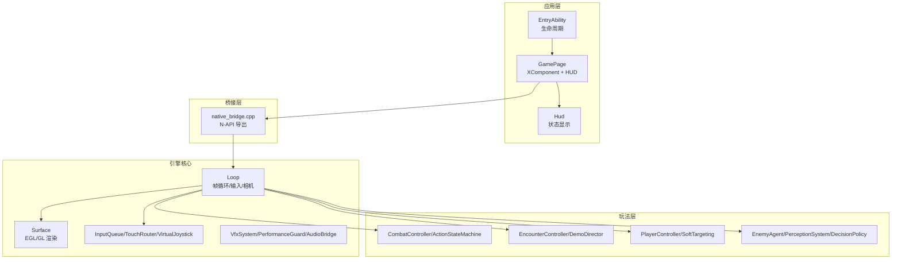
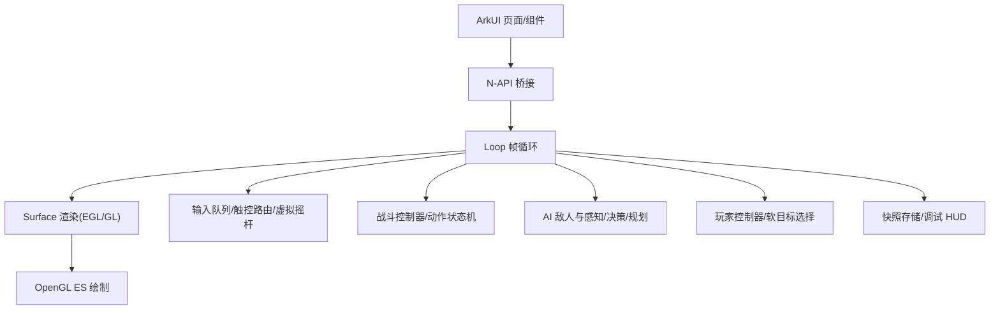
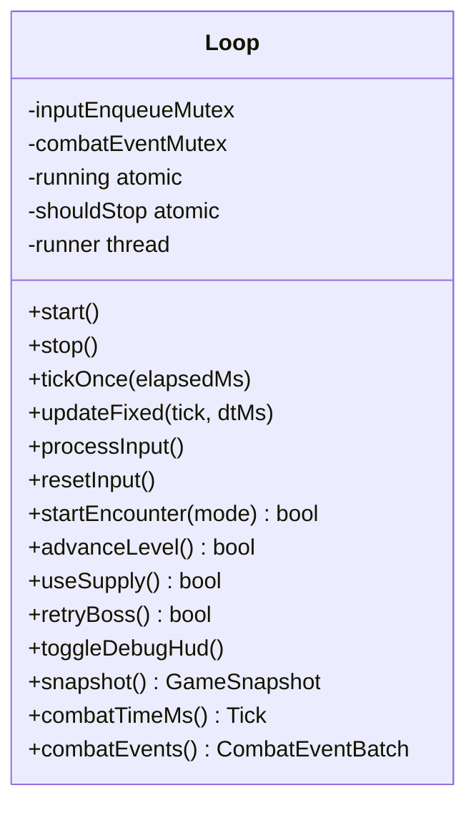
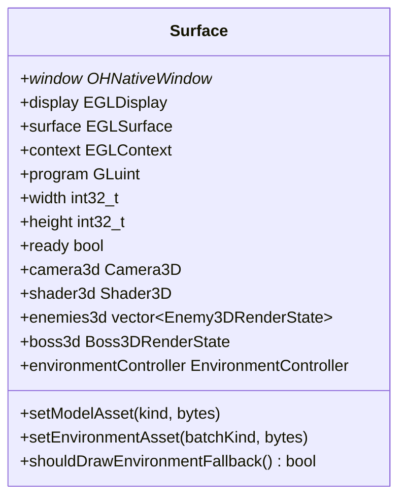
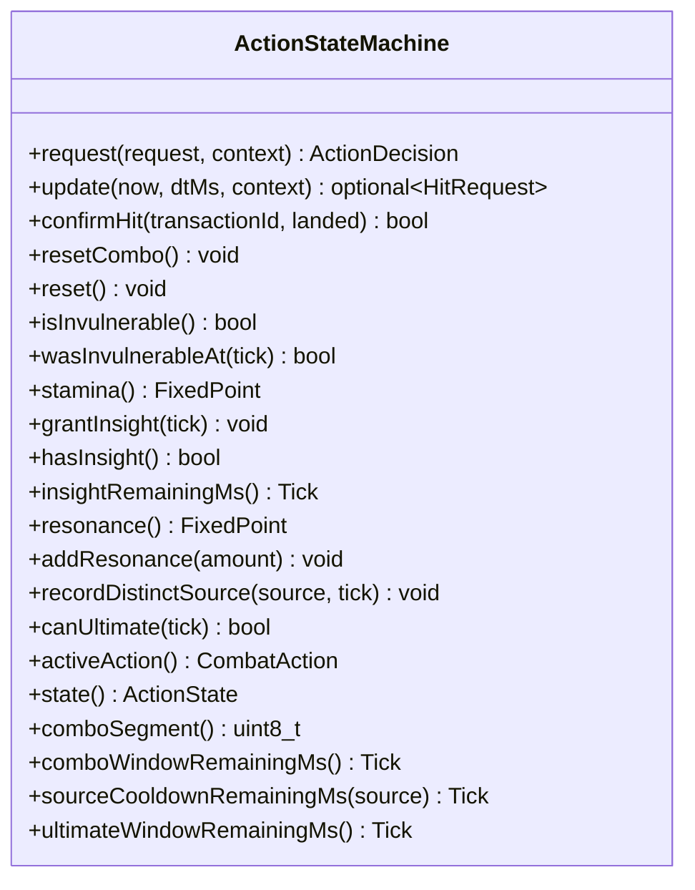
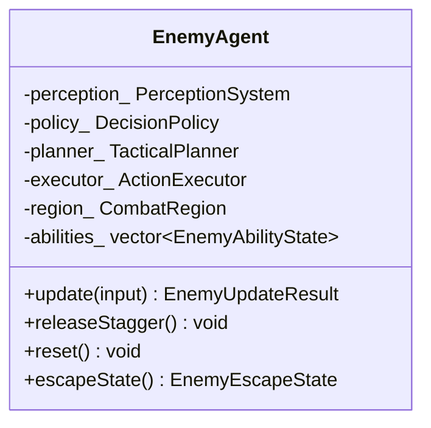
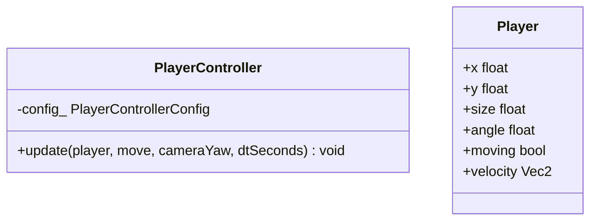
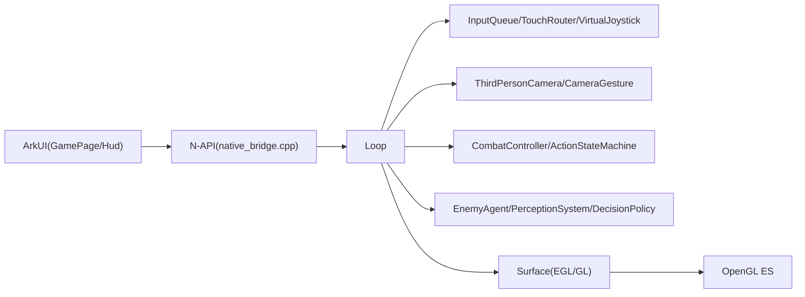

# 项目介绍与目标

<cite>
**本文引用的文件**   
- [EntryAbility.ets](file://entry/src/main/ets/EntryAbility.ets)
- [GamePage.ets](file://entry/src/main/ets/pages/GamePage.ets)
- [Hud.ets](file://entry/src/main/ets/ui/Hud.ets)
- [native_bridge.cpp](file://entry/src/main/cpp/native_bridge.cpp)
- [loop.h](file://native/engine/core/loop.h)
- [loop.cpp](file://native/engine/core/loop.cpp)
- [surface.h](file://native/engine/render/surface.h)
- [action_state_machine.h](file://native/gameplay/combat/action_state_machine.h)
- [enemy_agent.h](file://native/gameplay/ai/enemy_agent.h)
- [player_controller.h](file://native/gameplay/player/player_controller.h)
- [2026-07-12-harmonyos-openworld-rpg-design.md](file://docs/superpowers/specs/2026-07-12-harmonyos-openworld-rpg-design.md)
</cite>

## 目录
1. [引言](#引言)
2. [项目结构](#项目结构)
3. [核心组件](#核心组件)
4. [架构总览](#架构总览)
5. [详细组件分析](#详细组件分析)
6. [依赖关系分析](#依赖关系分析)
7. [性能考量](#性能考量)
8. [故障排查指南](#故障排查指南)
9. [结论](#结论)
10. [附录](#附录)

## 引言
本项目为 my-world HarmonyOS 开放世界 RPG，目标是开发一款基于 HarmonyOS 平台的移动开放世界角色扮演游戏。技术路线采用 C++ 原生引擎与 ArkUI 前端框架相结合：ArkUI 负责 UI、系统交互与资源加载；C++ 原生层通过 N-API 暴露接口，承载帧循环、渲染、输入处理、战斗逻辑与 AI 行为等核心能力。项目以“三源共鸣”为核心战斗机制，结合固定逻辑 tick、动作状态机、敌人 AI 与多阶段首领，构建可验证的单机探索—战斗—成长闭环体验。

项目的技术价值与创新点包括：
- 高性能 OpenGL ES 渲染管线与 XComponent/NativeWindow 集成，保证移动端稳定帧率与低延迟。
- 完整的动作状态机系统，支持连击窗口、冷却管理、无敌判定与终结时机。
- 确定性战斗模型与固定 tick，便于回放、调试与未来权威服务器扩展。
- 多平台适配能力（HarmonyOS NDK），通过桥接层隔离平台差异，保持核心代码跨平台可移植性。
- 数据驱动的资源与配置体系，支持版本化 Schema、校验与二进制发布优化。

本说明面向不同层次开发者，提供从高层架构到关键模块实现的清晰认知，帮助快速理解并参与项目开发。

## 项目结构
项目采用分层与模块化组织：
- entry：ArkTS/ArkUI 应用入口、页面、N-API 绑定与 UI 组件。
- native/engine：引擎核心，包含帧循环、渲染、输入、数学库、表现层与资源加载。
- native/gameplay：玩法逻辑，包括战斗、AI、实体、流程控制、成长与目标选择。
- native/platform/harmony：HarmonyOS 平台适配，如音频、生命周期、栅栏等待等。
- config/schema：配置 Schema 与开发期 JSON。
- assets：MVP 本地资源与清单。
- tests：单元测试与集成测试。
- automation：构建与性能采集脚本。



**图表来源** 
- [EntryAbility.ets:1-44](file://entry/src/main/ets/EntryAbility.ets#L1-L44)
- [GamePage.ets:1-305](file://entry/src/main/ets/pages/GamePage.ets#L1-L305)
- [native_bridge.cpp:1-577](file://entry/src/main/cpp/native_bridge.cpp#L1-L577)
- [loop.h:1-104](file://native/engine/core/loop.h#L1-L104)
- [surface.h:1-252](file://native/engine/render/surface.h#L1-L252)

**章节来源**
- [2026-07-12-harmonyos-openworld-rpg-design.md:316-333](file://docs/superpowers/specs/2026-07-12-harmonyos-openworld-rpg-design.md#L316-L333)

## 核心组件
- 帧循环 Loop：统一调度输入、更新、渲染与快照输出，维护运行状态、FPS、事件计数与调试 HUD。
- 渲染 Surface：封装 EGL/GL 上下文、3D 相机、模型与着色器、环境批处理与 VFX 标志。
- 输入处理 InputQueue/TouchRouter/VirtualJoystick：将触摸与虚拟摇杆转换为玩家意图与动作。
- 战斗系统 CombatController/ActionStateMachine：固定 tick 结算、连击窗口、冷却与终结时机、伤害与韧性计算。
- AI 行为 EnemyAgent：感知、决策策略、战术规划与动作执行，支持逃逸与分离。
- 玩家控制器 PlayerController：平滑移动、转向与速度控制。
- UI 层 GamePage/Hud：拉取快照、展示状态、触发输入与动作。

**章节来源**
- [loop.h:26-104](file://native/engine/core/loop.h#L26-L104)
- [surface.h:98-252](file://native/engine/render/surface.h#L98-L252)
- [action_state_machine.h:1-91](file://native/gameplay/combat/action_state_machine.h#L1-L91)
- [enemy_agent.h:1-107](file://native/gameplay/ai/enemy_agent.h#L1-L107)
- [player_controller.h:1-36](file://native/gameplay/player/player_controller.h#L1-L36)
- [GamePage.ets:1-305](file://entry/src/main/ets/pages/GamePage.ets#L1-L305)
- [Hud.ets:1-145](file://entry/src/main/ets/ui/Hud.ets#L1-L145)

## 架构总览
整体架构分为四层：
- ArkUI 表现与系统交互层：菜单、HUD、设置、系统能力接入。
- N-API 边界层：生命周期、输入事件、状态快照、批量命令。
- HarmonyOS NDK C++ 游戏核心：帧循环、相机、渲染、资源、碰撞、战斗 ECS。
- HarmonyOS 平台能力层：XComponent、NativeWindow、图形 API、音频、Game Service Kit。



**图表来源** 
- [2026-07-12-harmonyos-openworld-rpg-design.md:132-168](file://docs/superpowers/specs/2026-07-12-harmonyos-openworld-rpg-design.md#L132-L168)
- [native_bridge.cpp:518-561](file://entry/src/main/cpp/native_bridge.cpp#L518-L561)
- [loop.cpp:131-174](file://native/engine/core/loop.cpp#L131-L174)

## 详细组件分析

### 帧循环 Loop
- 职责：启动/停止线程、固定步长更新、输入入队、快照读取、遭遇战与演示导演控制。
- 关键成员：Surface、InputQueue、TouchRouter、VirtualJoystick、CameraGesture、PlayerIntent、PlayerController、ThirdPersonCamera、SoftTargeting、CombatController、EncounterController、DemoDirector、VfxSystem、PerformanceGuard、AudioBridge、FixedStep、SnapshotStore、LifecycleState。
- 线程安全：使用互斥保护输入入队与战斗事件批次，原子变量控制运行状态与时间。



**图表来源** 
- [loop.h:26-104](file://native/engine/core/loop.h#L26-L104)

**章节来源**
- [loop.cpp:131-200](file://native/engine/core/loop.cpp#L131-L200)

### 渲染 Surface
- 职责：EGL/GL 初始化与销毁、窗口尺寸变化、像素缓冲、3D 相机与模型、环境批处理、VFX 标志。
- 数据结构：Particle、Prop、TrainingTargetRenderState、Enemy3DRenderState、Boss3DRenderState、Surface。
- 资源提交：setModelAsset/setEnvironmentAsset 异步标记脏位，在 GL 上下文下解析上传替换销毁。



**图表来源** 
- [surface.h:98-252](file://native/engine/render/surface.h#L98-L252)

**章节来源**
- [surface.h:1-252](file://native/engine/render/surface.h#L1-L252)

### 动作状态机 ActionStateMachine
- 职责：请求动作、更新命中时间线、确认命中、连击窗口管理、冷却与终结时机、洞察与共鸣资源。
- 关键方法：request/update/confirmHit/resetCombo/reset/isInvulnerable/wasInvulnerableAt/stamina/grantInsight/hasInsight/insightRemainingMs/resonance/addResonance/recordDistinctSource/canUltimate/activeAction/state/comboSegment/comboWindowRemainingMs/sourceCooldownRemainingMs/ultimateWindowRemainingMs。



**图表来源** 
- [action_state_machine.h:1-91](file://native/gameplay/combat/action_state_machine.h#L1-L91)

**章节来源**
- [action_state_machine.h:1-91](file://native/gameplay/combat/action_state_machine.h#L1-L91)

### AI 敌人 Agent
- 职责：感知系统、决策策略、战术规划、动作执行、逃逸与分离、冷却管理与打断。
- 关键结构：EnemyUpdateInput/Result、EnemyAgentTuning、EnemyEscapeState。
- 更新流程：update(input) 返回意图、计划、状态、位置、移动、分离、命中、效果、中断、候选目标与逃逸状态。



**图表来源** 
- [enemy_agent.h:1-107](file://native/gameplay/ai/enemy_agent.h#L1-L107)

**章节来源**
- [enemy_agent.h:1-107](file://native/gameplay/ai/enemy_agent.h#L1-L107)

### 玩家控制器 PlayerController
- 职责：根据移动向量与相机朝向更新玩家位置、角度与速度，保证启停平滑无突跳。
- 配置：速度、转向速度、加速/减速平滑系数。



**图表来源** 
- [player_controller.h:1-36](file://native/gameplay/player/player_controller.h#L1-L36)

**章节来源**
- [player_controller.h:1-36](file://native/gameplay/player/player_controller.h#L1-L36)

### UI 与桥接
- EntryAbility：生命周期回调，加载 GamePage，前台/后台时调用 nativeStart/nativeStop。
- GamePage：XComponent 承载 Native 渲染，拉取快照更新 HUD，加载模型与环境资源，触发输入与动作。
- Hud：展示 HP、Poise、Stamina、三源槽、Boss 进度、调试信息等。
- native_bridge.cpp：注册 N-API 函数，处理表面生命周期、输入事件、资产提交、快照拉取与演示控制。

```mermaid
sequenceDiagram
participant UI as "ArkUI(GamePage)"
participant Bridge as "N-API(native_bridge.cpp)"
participant Loop as "Loop(帧循环)"
participant Render as "Surface(渲染)"
UI->>Bridge : pullSnapshot()
Bridge->>Loop : snapshot()
Loop-->>Bridge : GameSnapshot
Bridge-->>UI : Snapshot对象
UI->>Bridge : pushInput()/pushAction()
Bridge->>Loop : enqueueInput()/startEncounter()
UI->>Bridge : nativeSetModelAssets()/nativeSetEnvironmentAssets()
Bridge->>Loop : withLifecycle(setModelAsset/setEnvironmentAsset)
Loop->>Render : setModelAsset/setEnvironmentAsset
```

**图表来源** 
- [GamePage.ets:1-305](file://entry/src/main/ets/pages/GamePage.ets#L1-L305)
- [native_bridge.cpp:151-210](file://entry/src/main/cpp/native_bridge.cpp#L151-L210)
- [native_bridge.cpp:212-358](file://entry/src/main/cpp/native_bridge.cpp#L212-L358)
- [native_bridge.cpp:360-516](file://entry/src/main/cpp/native_bridge.cpp#L360-L516)
- [loop.cpp:131-174](file://native/engine/core/loop.cpp#L131-L174)

**章节来源**
- [EntryAbility.ets:1-44](file://entry/src/main/ets/EntryAbility.ets#L1-L44)
- [GamePage.ets:1-305](file://entry/src/main/ets/pages/GamePage.ets#L1-L305)
- [Hud.ets:1-145](file://entry/src/main/ets/ui/Hud.ets#L1-L145)
- [native_bridge.cpp:1-577](file://entry/src/main/cpp/native_bridge.cpp#L1-L577)

## 依赖关系分析
- ArkUI 与 N-API：通过 XComponent 与 N-API 绑定，避免逐帧对象往返，使用粗粒度快照与批量命令。
- Loop 与子系统：组合输入、相机、战斗、AI、表现与资源，单向依赖渲染与平台适配。
- Surface 与 OpenGL ES：EGL/GL 上下文由 Surface 管理，渲染路径只读消费逻辑状态。
- 战斗与 AI：ActionStateMachine 与 EnemyAgent 通过 EncounterController 协调，确保固定 tick 与确定性。



**图表来源** 
- [native_bridge.cpp:518-561](file://entry/src/main/cpp/native_bridge.cpp#L518-L561)
- [loop.h:26-104](file://native/engine/core/loop.h#L26-L104)
- [surface.h:98-252](file://native/engine/render/surface.h#L98-L252)

**章节来源**
- [2026-07-12-harmonyos-openworld-rpg-design.md:132-168](file://docs/superpowers/specs/2026-07-12-harmonyos-openworld-rpg-design.md#L132-L168)

## 性能考量
- 固定逻辑 tick：渲染帧率与逻辑结算解耦，提升稳定性与回放能力。
- 资源批处理：环境资产按批次提交，减少频繁上传开销。
- 性能监控：PerformanceGuard 与 FPS 统计，支持动态调整画质与 VFX。
- 内存与线程：互斥与原子操作保障线程安全，避免竞争与死锁。
- 设备分档：依据真机基线设定门槛，确保最低档稳定与推荐档体验。

[本节为通用指导，不直接分析具体文件]

## 故障排查指南
- 渲染失败：检查 surface_init/surface_resize 返回值与 OnSurfaceCreated/Changed/Destroyed 回调，确认 EGL/GL 上下文有效。
- 输入丢失：核对 pushInput/pushAction 参数类型与范围，确认 InputQueue 接受与序列号递增。
- 资产加载失败：查看 nativeSetModelAssets/nativeSetEnvironmentAssets 返回布尔值，回退到程序化网格或默认材质。
- 崩溃与黑屏：关注 lifecycle.start/stop 同步调用，确保前后台切换时正确重置状态与资源。
- 性能问题：启用 debugHud，观察 FPS、DrawCalls、Triangles、VFXFlags 与 perfLevel，定位瓶颈。

**章节来源**
- [native_bridge.cpp:59-111](file://entry/src/main/cpp/native_bridge.cpp#L59-L111)
- [native_bridge.cpp:151-210](file://entry/src/main/cpp/native_bridge.cpp#L151-L210)
- [native_bridge.cpp:212-358](file://entry/src/main/cpp/native_bridge.cpp#L212-L358)
- [loop.cpp:176-200](file://native/engine/core/loop.cpp#L176-L200)

## 结论
my-world HarmonyOS 开放世界 RPG 通过 ArkUI 与 C++ 原生引擎的分层架构，实现了高性能渲染、确定性战斗与可扩展 AI 行为。项目以 MVP 垂直切片验证玩法与技术可行性，为后续内容扩张与在线能力奠定基础。开发者可基于现有模块快速迭代，聚焦于三源共鸣的战斗深度与开放世界的内容生产。

[本节为总结，不直接分析具体文件]

## 附录
- 术语表：三源共鸣、源痕、遗物构件、ArkTS/ArkUI、HarmonyOS NDK、N-API、XComponent、ECS、固定逻辑 tick、权威服务器。
- MVP 范围检查：限定区域、角色、敌人、首领与闭环体验，不包含付费与多人联机。

**章节来源**
- [2026-07-12-harmonyos-openworld-rpg-design.md:374-402](file://docs/superpowers/specs/2026-07-12-harmonyos-openworld-rpg-design.md#L374-L402)