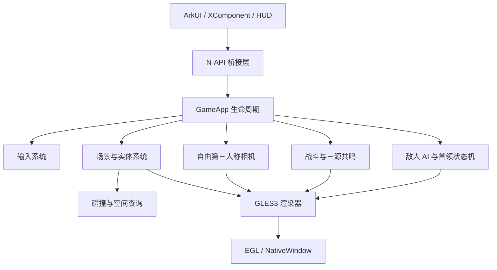

# 艾瑟兰自由第三人称战斗垂直切片设计

**日期：** 2026-07-14  
**状态：** 已批准  
**项目：** 艾瑟兰（Ethelan）HarmonyOS 原生手游  
**阶段目标：** 方案 1——分层构建 8–12 分钟单人战斗垂直切片

## 1. 背景与决策

项目已完成 HarmonyOS Native、XComponent、NativeWindow、EGL 与 GLES3 真机渲染链路验证。下一阶段不直接扩张开放世界，而是先验证自由第三人称移动、移动端动作战斗、三源共鸣和多阶段首领能否形成完整体验闭环。

参考作品仅用于提炼高层体验目标：自由探索式镜头、移动端动作反馈、读条、地面预警、打断、破韧及多阶段首领。角色、世界观、名称、数值、UI、技能、敌人轮廓和视听语言均保持原创，不直接复制现有作品。

已批准的关键决策：

- 选择单人战斗垂直切片，不先做开放世界或多人副本。
- 使用自由第三人称相机。
- 体验流程为训练区、两组普通敌人、精英和三阶段首领。
- 使用原创风格化灰盒资源，先验证操控、打击感和机制可读性。
- 真机目标 60 FPS，复杂战斗允许约 45 FPS，最低兼容目标 30 FPS。
- 首阶段只实现触屏输入，但通过输入抽象层预留手柄扩展。
- 难度定位为易上手、机制有压力；首领失败后快速重试。

## 2. 目标与非目标

### 2.1 目标

- 交付可在 HarmonyOS 真机运行的 8–12 分钟战斗流程。
- 建立自由相机、角色控制、战斗、AI、首领、事件、HUD 和表现之间的稳定模块边界。
- 完成普攻、闪避、三源技能、源反应和共鸣终结技。
- 完成三类敌人与一个三阶段原创首领。
- 建立自动化测试、调试 HUD、性能降级和真机验证流程。
- 为后续地图、角色、敌人、副本和开放世界扩展保留数据与接口边界。

### 2.2 非目标

- 大型开放世界、无缝流送、攀爬、游泳和飞行。
- 多角色切换、多人联机、团队副本和在线服务。
- 装备随机词条、抽卡、商城和付费系统。
- 复杂 NavMesh、动画编辑器及大规模剧情过场。
- 最终商业美术、完整配音和正式音乐资产。

## 3. 总体架构

架构约束：

- ArkUI 负责页面生命周期、HUD 和触屏事件，不承载战斗规则。
- N-API 只传递窗口、输入、暂停恢复和界面快照，不成为业务逻辑层。
- C++ 使用固定时间步更新战斗和 AI；渲染按独立帧间隔运行。
- 首阶段采用轻量实体与组件组合，不引入大型第三方 ECS。
- 相机、角色、技能和表现通过状态与事件协作，不直接修改彼此内部数据。
- EGL/GLES3 保持真机已验证的 WindowSurface 初始化和安全销毁顺序。
- 技能、敌人、首领和遭遇参数使用强类型数据配置。

单帧数据流：

`采集触屏输入 → 更新角色意图 → 固定步战斗/AI/碰撞 → 生成表现事件 → 更新相机 → 提交 GLES3 渲染 → 同步 HUD`

## 4. 输入、移动与相机

- 左侧虚拟摇杆控制角色相对相机方向移动。
- 右侧滑动控制水平环绕和俯仰；俯仰与距离有限制并使用缓动。
- 首阶段实现触屏输入抽象：移动向量、镜头增量、普攻、闪避、三个源技能和终结技。
- 软锁定优先修正角色前方合理范围内的目标，同时允许自由转向和脱锁。
- 输入采集不受命中停顿影响；战斗逻辑在固定 tick 中消费规范化意图。
- 后续手柄只需提供相同动作语义，不进入本阶段交付范围。

## 5. 角色战斗

### 5.1 基础动作

- 普攻为四段连击；移动、受击或超过衔接窗口时重置。
- 闪避消耗体力并具有短暂无敌帧。
- 精准闪避触发短时“源流洞察”，提升下一次源技能收益。
- 三个源技能对应辉印、脉流和蚀质。
- 共鸣能量充满后释放终结技。

角色状态拆分为移动状态机、动作状态机、生命/韧性、源附着、冷却/体力和伤害结算。伤害结算只产生确定性结果和事件，特效、音频、镜头与 HUD 只消费表现事件。

### 5.2 三源共鸣

| 源 | 核心作用 |
|---|---|
| 辉印 | 标记目标、显示弱点、增强后续源反应可读性 |
| 脉流 | 位移、牵引、传导和连携准备 |
| 蚀质 | 削减韧性、施加侵蚀、改变防御状态 |

| 组合 | 结果 |
|---|---|
| 辉印 + 脉流 | 折光：在目标之间传递伤害并短暂暴露弱点 |
| 脉流 + 蚀质 | 凝滞：限制移动并提高打断强度 |
| 辉印 + 蚀质 | 崩解：快速削减韧性并追击破韧目标 |
| 限时完成三源连携 | 共鸣爆发：高收益终结窗口 |

首阶段不加入装备随机词条、角色切换和复杂元素克制。

## 6. 敌人 AI

AI 使用感知、决策、执行三层结构：

- 感知层处理视野、距离、受击和战斗区域。
- 决策层使用状态机和数据化技能权重。
- 执行层负责移动、转向、前摇、判定帧和恢复阶段。

基础状态为待机、警戒、追击、攻击、硬直和死亡。首阶段采用战斗区域约束、简单转向和障碍回避，不实现复杂 NavMesh。

敌人原型：

1. **裂爪兽：**近战追击型，用明显前摇训练闪避和背后攻击。
2. **辉印祭司：**远程支援型，为友军附加护盾并释放可打断读条。
3. **蚀甲守卫：**高韧性精英，正面减伤，要求崩解、绕后或精准闪避。

普通敌人不得重叠卡死、无限追击或越过战斗区域攻击。无法到达目标时返回区域内的安全决策状态。

## 7. 三阶段首领

首领名为“渊铸守门者·卡洛恩”，定位为古代源能遗迹的重甲守卫。

### 7.1 第一阶段：辉印封锁（100%–70%）

- 扇形重击训练横向闪避。
- 辉印锁定在玩家脚下生成延迟爆炸区域。
- 源能护甲要求先用辉印暴露弱点。
- 可打断读条“审判光束”成功后产生短暂破绽。

### 7.2 第二阶段：脉流风暴（70%–35%）

- 首领跃回中央并释放环形击退。
- 旋转脉流带持续改变安全区域。
- 召唤两只裂爪兽，允许使用脉流牵引聚怪。
- “源流过载”要求先击破两个场地节点，再攻击首领。
- 机制成功后进入长破绽。

### 7.3 第三阶段：蚀质崩解（35%–0%）

- 护甲破裂后攻击加速，但韧性恢复减慢。
- 连续地面裂隙迫使玩家改变站位。
- “终末熔铸”要求在读条结束前触发三源共鸣爆发。
- 精准闪避可延长共鸣窗口。
- 首次机制失败造成高伤害和危险状态，连续失败通常导致战斗失败。

阶段阈值只能触发一次。异常状态必须保留可诊断快照，不能静默重置。

## 8. 关卡流程

| 环节 | 目标时长 | 教学目标 |
|---|---:|---|
| 起始训练区 | 约 1 分钟 | 移动、相机、基础攻击 |
| 裂爪兽战斗 | 1–2 分钟 | 闪避、连击、软锁定 |
| 祭司混合战 | 约 2 分钟 | 打断、目标优先级 |
| 蚀甲守卫精英 | 约 2 分钟 | 破韧、绕后、源反应 |
| 补给与首领入口 | 约 30 秒 | 恢复资源、建立重试点 |
| 三阶段首领 | 3–5 分钟 | 综合检验三源共鸣与机制执行 |

场景采用环形遗迹路线，可提前看到最终首领区域。战斗门在当前敌人全部击败后开放，不依赖完整任务系统。首领失败后从入口直接重试，不重复前置战斗，并确保 5 秒内可重新开始。

## 9. HUD 与战斗反馈

### 9.1 HUD

- 左上显示生命、韧性、体力和源附着。
- 顶部中央显示首领生命、韧性、阶段和关键读条。
- 左下为虚拟摇杆；右下为普攻、闪避、三源技能和终结技。
- 中央显示软锁定、弱点、交互和打断提示。
- 技能按钮使用冷却遮罩，避免持续堆叠数值。
- 非战斗状态淡出战斗控件。
- 调试模式显示 FPS、角色状态、目标距离、AI 状态、阶段与碰撞体。

### 9.2 命中与机制反馈

- 普攻使用短促闪光、轻微命中停顿和低幅镜头震动。
- 重击与破韧强化粒子、停顿和音效。
- 精准闪避使用短时慢速、边缘辉光和独立提示音。
- 打断成功使读条碎裂、动作中止并显示破绽。
- 玩家受击使用方向提示和角色闪烁，不以大面积红屏遮挡操作。
- 无效攻击以护甲火花和低沉音效提示更换策略。

命中停顿只作用于局部战斗表现，不暂停输入采集、HUD 和生命周期线程。

## 10. 原创视听语言

| 系统 | 视觉语言 |
|---|---|
| 辉印 | 金白几何刻印、折射线、弱点轮廓 |
| 脉流 | 青蓝流线、牵引轨迹、空间波纹 |
| 蚀质 | 暗紫碎裂纹、重颗粒、结构剥落 |
| 三源共鸣 | 三色聚合为白色核心后产生环形冲击 |

敌方预警规范：普通可闪避攻击使用橙色；必须打断使用黄色读条与脉冲图标；致命机制使用红色边界、递增音频和屏幕边缘提示。关键机制不能只依赖颜色或声音。

音频分为动作、命中、源能力、机制、环境和动态音乐六层。首阶段只使用原创或许可清晰的占位素材。

## 11. 数据驱动与事件

首阶段采用 C++ 强类型配置，并预留后续 JSON5 加载接口：

- `PlayerConfig`
- `AbilityConfig`
- `EnemyConfig`
- `BossPhaseConfig`
- `VfxConfig`
- `EncounterConfig`

系统通过轻量事件队列解耦。事件包含 tick、来源实体、目标实体、事件类型和必要参数，覆盖命中、伤害、受击、闪避、打断、破韧、源附着、源反应、阶段切换、死亡和战斗重置。

Native 层以 10–20 Hz 生成 HUD 快照，避免逐事件跨 N-API 更新。配置加载失败时使用经过测试的安全默认值；关键首领配置缺失时拒绝进入战斗并输出明确错误。

## 12. 错误处理与性能降级

- EGL、GLES 和 NativeWindow 沿用已验证的安全停止策略。
- Surface 失效时先停止并等待渲染线程退出，再释放资源。
- 无效实体句柄、重复死亡、重复阶段切换和越界目标必须被拒绝并记录。
- HUD 拉取失败时保留上次有效快照，不影响 Native 循环。
- 日志按 Lifecycle、Render、Combat、AI 和 Encounter 分类。

性能压力升高时依次减少次要粒子、降低拖尾和地面特效细分、降低非关键光影更新频率、降低调试信息频率。不得降级敌方预警、首领读条、命中判定和三源状态表现，也不得改变战斗结果。

## 13. 测试与验收

### 13.1 单元测试

- 输入死区、相机俯仰和距离限制。
- 体力、冷却、无敌帧和连击重置。
- 三源附着、反应顺序、共鸣窗口和重复触发保护。
- 伤害、韧性、打断和死亡状态。
- AI 状态转换与技能选择。
- 首领阶段阈值、单次触发和重试重置。
- 配置校验、事件顺序、容量和清理。

### 13.2 集成测试

- 输入到移动和相机更新。
- 攻击到判定、事件和 HUD 快照。
- 三源连携到共鸣爆发。
- 首领第一阶段到死亡的完整推进。
- 重试时实体、机制和计时器完整复位。
- Surface 销毁时战斗与渲染循环安全停止。

### 13.3 真机门槛

- 双指同时操作移动、镜头与技能。
- 完整流程连续通关，首领可反复失败和重试。
- 目标 60 FPS，复杂压力场景约 45 FPS，最低兼容 30 FPS。
- 持续战斗至少 10 分钟，无崩溃、死锁和明显内存增长。
- 冷启动、前后台、锁屏恢复和 Surface 重建稳定。
- 所有高伤害攻击在命中前均有视觉提示。
- 精准闪避、打断、破韧和共鸣爆发反馈可以明确区分。

## 14. 阶段交付物

- HarmonyOS 真机可运行的 8–12 分钟战斗垂直切片。
- 自由第三人称触控相机与角色控制。
- 普攻、闪避、三源技能与共鸣终结技。
- 三类敌人、完整基础 AI 和一个三阶段原创首领。
- 原创灰盒遗迹、HUD、关键 VFX 和占位音频。
- C++ 自动化测试、调试 HUD、性能记录和真机验证记录。
- 支撑后续开放世界、角色和副本扩展的模块边界。

## 15. 后续步骤

本设计批准并保存后，编写分阶段实施计划。实施计划必须优先拆分基础架构和测试边界，再依次完成输入/相机、战斗、AI、首领、关卡、HUD/表现及真机优化，不允许以硬编码原型跳过模块边界。
